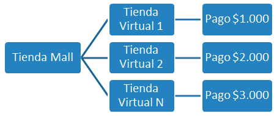

   * [Descripción](#descripción)
   * [Requisitos](#requisitos)
      * [Ayuda para instalación](#ayuda-para-instalación)
         * [Instalar Django](#instalar-django)
         * [Instalar Librerías](#instalar-librerías)
         * [Instalar pip y py-wsse](#instalar-pip-y-py-wsse)
   * [Instalación](#instalación)
      * [Ejecución para ejemplo WEB (DJANGO):](#ejecución-para-ejemplo-web-django)
      * [Datos de Prueba ambiente Integración.](#datos-de-prueba-ambiente-integración)
   * [Conceptos Básicos](#conceptos-básicos)
      * [Certificados](#certificados)
      * [Ambientes de trabajo](#ambientes-de-trabajo)
      * [Productos Webpay](#productos-webpay)
   * [Documentación SDK](#documentación-sdk)
      * [Transacción Webpay normal](#transacción-webpay-normal)
         * [Configuración](#configuración)
         * [Iniciar Transacción (initTransaction)](#iniciar-transacción-inittransaction)
         * [Rescatar Resultado (getTransactionResult)](#rescatar-resultado-gettransactionresult)
            * [Valores específicos](#valores-específicos)
               * [paymentTypeCod](#paymenttypecod)
               * [responseCode](#responsecode)
               * [VCI](#vci)
         * [Finalizar Transacción](#finalizar-transacción)
      * [Transacción Mall](#transacción-mall)
         * [Configuración](#configuración-1)
         * [Iniciar Transacción (initTransaction)](#iniciar-transacción-inittransaction-1)
         * [Rescatar Resultado (getTransactionResult)](#rescatar-resultado-gettransactionresult-1)
            * [Valores específicos](#valores-específicos-1)
               * [paymentTypeCod](#paymenttypecod-1)
               * [responseCode](#responsecode-1)
               * [VCI](#vci-1)
         * [Finalizar Transacción](#finalizar-transacción-1)
      * [Transacción Oneclick](#transacción-oneclick)
         * [Configuración](#configuración-2)
         * [Iniciar Inscripción (initInscription)](#iniciar-inscripción-initinscription)
         * [Finalizar Inscripción (finishInscription)](#finalizar-inscripción-finishinscription)
         * [Autorizar (authorize)](#autorizar-authorize)
         * [Reversa (codeReverseOneClick)](#reversa-codereverseoneclick)
         * [Eliminar Usuario (removeUser)](#eliminar-usuario-removeuser)
      * [Anulación](#anulación)
         * [Configuración](#configuración-3)
         * [Anular (Nullify)](#anular-nullify)
         * [Códigos de error](#códigos-de-error)
      * [Transacción Webpay captura diferida](#transacción-webpay-captura-diferida)
         * [Configuración](#configuración-4)
         * [Captura (capture)](#captura-capture)
         * [Códigos de error](#códigos-de-error-1)

# Descripción 

Esta Librería está orientada a usuarios con conocimientos intermedios de programación, que buscan desarrollar sus propias soluciones de e-commerce. Estas encapsulan métodos de comunicación y cifrado para facilitar la integración de desarrollos propietarios al portal de pago Webpay.

En este manual contiene la descripción básica de clases y métodos necesarios.

# Requisitos

Esta librería fue desarrolla para trabajar sobre un sistema Linux con ambiente web conectado a internet que contenga a lo menos:

- Python 2.7.6 o superior
- Django versión 1.8.7 o superior (Solo para ejemplo WEB)
- SO basado en Linux
- Librerías WSSE, SUDS Incluidas en Archivo Webpay: Se deben mover según lo indicado más abajo.
- OpenSSL, libxml2 y libxmlsec1Ver comando de instalación más abajo.

## Ayuda para instalación

### Instalar Django

```
apt-get update
sudo apt-get install python-django
```

### Instalar Librerías

En Debian/Ubuntu:

```
sudo apt-get install libssl-dev libxml2-dev libxmlsec1-dev
```
Sistemas basados en RedHat:
```
sudo yum install openssl-devel libxml2-devel xmlsec1-devel xmlsec1-openssl-devel libtool-ltdl-devel
```

### Instalar pip y py-wsse
```
apt install python-pip
pip install py-wsse
```

Con esto deberíamos tener nuestras librerías instaladas y funcionando, sin embargo la librería “suds” contiene un bug/feature. Por lo anterior, recomendamos copiar y reemplazar las carpetas suds y wsse, que se encuentran en el directorio “libwebpay” de este SDK, por las que se encuentran en el directorio dist-packages de python. La ruta donde se encuentra generalmente será: /usr/local/lib/python2.7/dist-packages


Este proyecto depende de OpenSSL, libxml2 y libxmlsec1 para su correcto funcionamiento, por lo que estas deben estar instaladas:

En Debian/Ubuntu:
```
sudo apt-get install libssl-dev libxml2-dev libxmlsec1-dev 
```

Sistemas basados en RedHat:

```
sudo yum install openssl-devel libxml2-devel xmlsec1-devel xmlsec1-openssl-devel libtool-ltdl-devel
```

# Instalación

[Descargar el sdk](https://github.com/TransbankDevelopers/libwebpay-python/archive/v2.0.3.zip
) y guárdala en una carpeta de tu computador.
Descomprima el contenido dentro del directorio webroot de su servidor.
Las carpetas incluidas son:

- `libwebpay/` Contiene paquete de librerías Webpay y dependencias.
- `sample/` Contiene paquete de librerías Webpay y dependencias para ejecución vía web.
- `sample/certificates` Clases de configuración y Certificados de cifrado de ejemplo (solo para ambiente de Integración)


## Ejecución para ejemplo WEB (DJANGO): 

Para su ejecución se debe ingresar al directorio principal de la aplicación y ejecutar el comando runserver el cual nos levantará un ambiente web mostrando la IP/PUERTO desde el cual podremos acceder mediante nuestro navegador WEB, seguido de la ruta /sample/tbk_normal/default.

http://127.0.0.1:8000/sample/tbk_normal/default

```
$ cd /home/webpay/Documentos/webpay-sdk-python-1-1
$ python manage.py runserver

Performing system checks...

System check identified no issues (0 silenced).
April 11, 2016 - 20:26:35
Django version 1.9.5, using settings 'webpay-sdk-python.settings'
Starting development server at http://127.0.0.1:8000/
Quit the server with CONTROL-C.
```

## Datos de Prueba ambiente Integración.

Tarjeta VISA
 
Nro 4051885600446623
 
CVV 123


# Conceptos Básicos

## Certificados

Para la comunicación con Webpay es necesaria la creación de certificados de cifrado. Para su creación, es necesario contar con un código de comercio propio entregado por Transbank, una vez registrado como comercio vía los canales comerciales (mesa ayuda).

En este SDK, se incluyen certificados de prueba creados con un código de comercio genérico, que podrán ser utilizados para fines de prueba e integración.

## Ambientes de trabajo

Para la interacción con los e-commerce, Webpay expone Webservices estilo SOAP firmados digitalmente en distintas URL (encapsulados en esta librería).

Webpay cuenta con 3 ambientes de trabajo, que requerirán distintos códigos de comercio y certificados:
•   Integración: utilizado para realizar desarrollos y pruebas.
•   Certificación: utilizado certificar el portal del comercio antes del lanzamiento.
•   Producción: ambiente oficial con transacciones reales.

Este SDK ya incluye la configuración de las distintas URLs utilizadas por cada ambiente.

Si requiere información acerca de la conexión directa los WebServices SOAP, visite https://www.transbank.cl

## Productos Webpay

Webpay cuenta diversos productos según si requerimientos, los que tendrán que ser acordados con su agente comercial al momento de registrarse como comercio. 

Estos son:
- Webpay Normal: Para transacciones normales con captura y cargo inmediato.
- Webpay Captura Diferida: Cuando requiere reservar crédito del cliente para confirmar la transacción con posterioridad.
- Webpay Mall: Para comercios que sub-agrupan pequeños departamentos y necesitan diferenciar los pagos.
- Webpay Onclick: Para quienes requieren comprar con solo un click (el comercio es responsable frente a fraudes de usurpación de identidad).
- Webpay Anulación: Permite anular transacciones ya realizadas.

Cada producto presenta distintos flujos y datos en sus llamadas, los cuales son descriptos en forma básica en este documento.

# Documentación SDK

## Transacción Webpay normal

Una transacción de autorización normal (o transacción normal), corresponde a una solicitud de autorización financiera de un pago con tarjetas de crédito o débito, en donde quién realiza el pago ingresa al sitio del comercio, selecciona productos o servicio, y el ingreso asociado a los datos de la tarjeta de crédito o débito lo realiza en forma segura en Webpay.


### Configuración

```python             
from configuration import Configuration
from webpay import Webpay
                            
configuration = Configuration()
configuration.setEnvironment(environment)
configuration.setCommerceCode(commerce_code)
configuration.setPrivateKey(private_key)
configuration.setPublicCert(public_cert)
configuration.setWebpayCert(webpay_cert)
webpay = Webpay(configuration)
```


Parámetro | Tipo | Descripción
--------- | ------- | -----------
commerce_code | String | Código de comercio.
private_key | String | Llave privada.
public_cert | String | Certificado público.
webpay_cert | String | Certificado del servidor
environment | String | Ambiente "INTEGRACION", "CERTIFICACION", "PRODUCCION"


### Iniciar Transacción (initTransaction)

Inicia la transacción devolviendo el id de transacción

```python
client = webpay.getNormalTransaction().initTransaction(amount, buyOrder, sessionId, urlReturn, urlFinal);
```

Parámetro | Tipo | Descripción
--------- | ------- | -----------
amount | Integer | Monto.
buyOrder | String | Orden de compra.
sessionId | String | Identificador de sesión.
urlReturn | String | URL retorno. 
urlFinal | String | URL final.

Retorno | Tipo | Descripción
--------- | ------- | -----------
token |String | Token identificador transacción
url | String | Url webpay.

### Rescatar Resultado (getTransactionResult)

Método que permite obtener el resultado de la transacción y los datos de la misma.

```python
transactionResultOutput = client.service.getTransactionResult(token)
```

Parámetro | Tipo | Descripción
--------- | ------- | -----------
token | String | Token id de transacción.

En este punto ya hemos confirmado la transacción con Transbank realizando la operación acknowledgeTransaction mediante getTransactionResult. AcknowledgeTransaction Indica a Webpay que se ha recibido conforme el resultado de la transacción.


Retorno | Tipo | Descripción
--------- | ------- | -----------
buyOrder |String | Orden de compra.
sessionId | String | Identificador de sesión.
cardDetails |carddetails | Datos de tarjeta de crédito.
accoutingDate | String | Fecha de la autorización.
transactionDate |String | Fecha, hora de la autorización.
VCI | String | Resultado de la autenticación.
urlRedirection |String | URL de redirección.
detailsOutput | wsTransactionDetailOutput | Detalle de transacción financiera.

Objeto cardDetails:

Campo | Tipo | Descripción
------|------|------------
cardNumber|String|4 últimos números t. de crédito.
cardExpirationDate|String|Fecha de expiración.

Objeto wsTransactionDetailOutput:

Campo | Tipo | Descripción
------|------|------------
authorizationCode|String|Código de autorización.
paymentTypeCode|String|Tipo de pago.
responseCode|String|Código de respuesta.
Amount|String|Monto de la transacción.
sharesNumber|String|Cantidad de cuotas.
commerceCode|String|Código comercio de la tienda (Opcional).
buyOrder|String|Orden de compra de la tienda.


#### Valores específicos

##### paymentTypeCod

VD = Venta Debito.

VN = Venta Normal.

VC = Venta en cuotas.

SI = 3 cuotas sin interés.

S2 = 2 cuotas sin interés.

NC = N Cuotas sin interés.

##### responseCode

0 Transacción aprobada.

-1 Rechazo de transacción.

-2 Transacción debe reintentarse.

-3 Error en transacción.

-4 Rechazo de transacción.

-5 Rechazo por error de tasa.

-6 Excede cupo máximo mensual.

-7 Excede límite diario por transacción.

-8 Rubro no autorizado.


##### VCI

TSY: Autenticación exitosa.

TSN: autenticación fallida.

TO : Tiempo máximo excedido para autenticación.

ABO: Autenticación abortada por tarjetahabiente.

U3 : Error interno en la autenticación.

Vacío si la transacción no se autentico.

### Finalizar Transacción

Antes de finalizar, se debe primero redireccionar al voucher de Transbank, luego este re direccionará al cliente a la URL_FINAL indicando el token. Con los datos almacenados en el paso anterior se puede desplegar el voucher propio del comercio.

## Transacción Mall

Una transacción Mall Normal corresponde a una solicitud de autorización financiera de un conjunto de pagos con tarjetas de crédito o débito, en donde quién realiza el pago ingresa al sitio del comercio, selecciona productos o servicios, y el ingreso asociado a los datos de la tarjeta de crédito o débito lo realiza una única vez en forma segura en Webpay para el conjunto de pagos. Cada pago tendrá su propio resultado, autorizado o rechazado.

El Mall Webpay agrupa múltiples tiendas, son estas últimas las que pueden generar transacciones. Tanto el mall como las tiendas asociadas son identificadas a través de un número denominado código de comercio.




### Configuración

```python             
from configuration import Configuration
from webpay import Webpay
                            
configuration = Configuration()
configuration.setEnvironment(environment)
configuration.setCommerceCode(commerce_code)
configuration.setPrivateKey(private_key)
configuration.setPublicCert(public_cert)
configuration.setWebpayCert(webpay_cert)
configuration.setStoreCodes(store_codes)
webpay = Webpay(configuration)
```
Parámetro | Tipo | Descripción
--------- | ------- | -----------
commerce_code | String | Código de comercio.
private_key | String | Llave privada.
public_cert | String | Certificado público.
webpay_cert | String | Certificado del servidor
environment | String | Ambiente "INTEGRACION", "CERTIFICACION", "PRODUCCION"
store_codes | Array | Códigos de tiendas.

### Iniciar Transacción (initTransaction)

Permite inicializar una transacción en Webpay. Como respuesta a la invocación se genera un token que representa en forma única una transacción. Es importante considerar que una vez invocado este método, el token que es entregado tiene un periodo reducido de vida de 5 minutos, posterior a esto el token es caducado y no podrá ser utilizado en un pago.

```ruby
client = webpay.getMallNormalTransaction().initTransaction(amount, buyOrder, sessionId, urlReturn, urlFinal, stores)
```

Parámetro | Tipo | Descripción
--------- | ------- | -----------
buyOrder | Integer | Código único de orden de compra.
sessionId | String | Identificador de sesión (Opcional).
urlReturn | String | URL retorno. 
urlFinal | String | URL final.
stores | Array | Arreglo de `dict`s con datos de tiendas.

Cada elemento dentro de `stores` es un `dict` con los siguientes elementos:

Key | Tipo | Valor
--------- | ------- | -----------
storeCode  |String | Código de Tienda.
amount |int | Monto.
buyOrder | String | Orden de compra.
sessionId | String | Identificador de sesión (Opcional).

Como resultado se obtiene:

Retorno | Tipo | Descripción
--------- | ------- | -----------
token |String | Token identificador transacción
url | String | Url webpay.

### Rescatar Resultado (getTransactionResult)

Permite obtener el resultado de la transacción una vez que Webpay ha resuelto su autorización financiera.

 ```python
 webpay.getMallNormalTransaction().getTransaction(token);
 ```

Parámetro | Tipo | Descripción
--------- | ------- | -----------
token | String | Token id de transacción.


Retorno | Tipo | Descripción
--------- | ------- | -----------
buyOrder | Integer | Orden de compra.
sessionId | String | Identificador de sesión.
cardDetails | carddetails | Datos de tarjeta de crédito.
accoutingDate | String | Fecha de la autorización
transactionDate | String | Fecha, hora de la autorización.
VCI | String | Resultado de la autenticación.
urlRedirection | String | URL de redirección.
detailsOutput | wsTransactionDetailOutput | Detalle de transacción financiera.

Objeto cardDetails:

Campo | Tipo | Descripción
------|------|------------
cardNumber|String|4 últimos números t. de crédito.
cardExpirationDate|String|Fecha de expiración.

Objeto wsTransactionDetailOutput:

Campo | Tipo | Descripción
------|------|------------
authorizationCode|String|Código de autorización.
paymentTypeCode|String|Tipo de pago.
responseCode|String|Código de respuesta.
Amount|String|Monto de la transacción.
sharesNumber|String|Cantidad de cuotas.
commerceCode|String|Código comercio de la tienda (Opcional).
buyOrder|String|Orden de compra de la tienda.

En este punto ya hemos confirmado la transacción con Transbank realizando la operación acknowledgeTransaction mediante getTransactionResult. AcknowledgeTransaction Indica a Webpay que se ha recibido conforme el resultado de la transacción.


#### Valores específicos

##### paymentTypeCod

VD = Venta Debito.

VN = Venta Normal.

VC = Venta en cuotas.

SI = 3 cuotas sin interés.

S2 = 2 cuotas sin interés.

NC = N Cuotas sin interés.

##### responseCode

0 Transacción aprobada.

-1 Rechazo de transacción.

-2 Transacción debe reintentarse.

-3 Error en transacción.

-4 Rechazo de transacción.

-5 Rechazo por error de tasa.

-6 Excede cupo máximo mensual.

-7 Excede límite diario por transacción.

-8 Rubro no autorizado.


##### VCI

TSY: Autenticación exitosa.

TSN: autenticación fallida.

TO : Tiempo máximo excedido para autenticación.

ABO: Autenticación abortada por tarjetahabiente.

U3 : Error interno en la autenticación.

Vacío si la transacción no se autentico.

### Finalizar Transacción

Antes de finalizar, se debe redireccionar al voucher de Transbank, luego este re-direccionará al cliente a la URL_FINAL indicando el token. Con los datos almacenados en el paso anterior se puede desplegar el voucher propio del comercio.


## Transacción Oneclick

La modalidad de pago Oneclick permite al tarjetahabiente realizar pagos en el comercio sin la necesidad de ingresar cada vez información de la tarjeta de crédito al momento de realizar la compra. El modelo de pago contempla un proceso previo de inscripción o enrolamiento del tarjetahabiente, a través del comercio, que desee utilizar el servicio. Este tipo de pago facilita la venta, disminuye el tiempo de la transacción y reduce los riesgos de ingreso erróneo de los datos del medio de pago.

### Configuración


```python             
from configuration import Configuration
from webpay import Webpay
                            
configuration = Configuration()
configuration.setEnvironment(environment)
configuration.setCommerceCode(commerce_code)
configuration.setPrivateKey(private_key)
configuration.setPublicCert(public_cert)
configuration.setWebpayCert(webpay_cert)
webpay = Webpay(configuration)
```


Parámetro | Tipo | Descripción
--------- | ------- | -----------
commerce_code | String | Código de comercio.
private_key | String | Llave privada.
public_cert | String | Certificado público.
webpay_cert | String | Certificado del servidor
environment | String | Ambiente "INTEGRACION", "CERTIFICACION", "PRODUCCION"

### Iniciar Inscripción (initInscription)

Permite realizar la inscripción del tarjetahabiente e información de su tarjeta de crédito. Retorna como respuesta un token que representa la transacción de inscripción y una URL (UrlWebpay), que corresponde a la URL de inscripción de One Click. Una vez que se llama a este servicio Web, el usuario debe ser redireccionado vía POST a urlWebpay con parámetro TBK_TOKEN igual al token obtenido.

 ```python
client = webpay.getOneClickTransaction().initInscription(username, email, urlReturn)
```

Parámetro | Tipo | Descripción
--------- | ------- | -----------
username | String |  Nombre de usuario o cliente en el sistema del comercio.
email | String | Dirección de correo electrónico registrada por el comercio.
urlReturn | String | URL de retorno.


Retorno | Tipo | Descripción
--------- | ------- | -----------
token |String | Token identificador transacción
url | String | Url webpay.

### Finalizar Inscripción (finishInscription)

Permite finalizar el proceso de inscripción del tarjetahabiente en Oneclick. Entre otras cosas, retorna el identificador del usuario en Oneclick, el cual será utilizado para realizar las transacciones de pago. Una vez terminado el flujo de inscripción en Transbank el usuario es enviado a la URL de fin de inscripción que definió el comercio. En ese instante el comercio debe llamar a finishInscription.

 
```python
webpay.getOneClickTransaction().finishInscription(token)
```

Parámetro | Tipo | Descripción
--------- | ------- | -----------
token | String | Token id de transacción.


Retorno | Tipo | Descripción
--------- | ------- | -----------
authCode | String | Código de Retorno.
creditCardType | Integer | Tipo de tarjeta inscrita.
last4CardDigits |String | Los últimos 4 dígitos de la tarjeta.
responseCode | String | Código que identifica autorización.
tbkUser | String | Identificador único de la inscripción.

### Autorizar (authorize)

Permite realizar transacciones de pago. Retorna el resultado de la autorización. Este método que debe ser ejecutado, cada vez que el usuario selecciona pagar con Oneclick.

```python
client = webpay.getOneClickTransaction().authorize(buyOrder, tbkUser, username, amount)
```

Parámetro | Tipo | Descripción
--------- | ------- | -----------
buyOrder |Long | Orden de compra.
tbkUser | String | Id usuario
username | String | Nombre de usuario.
amount |BigDecimal | Monto.


Retorno | Tipo | Descripción
--------- | ------- | -----------
authCode | String | Código de autorización.
creditCardType | Integer | Tipo de tarjeta inscrita.
last4CardDigits |String | Los últimos 4 dígitos de la tarjeta.
responseCode | String | Código que identifica autorización.
transactionId | String | Identificador único de la transacción.

Código | Descripción
------ | -----------
0 | Aprobado
-1 | Rechazado
-2 | Rechazado
-3 | Rechazado
-4|Rechazado
-5|Rechazado
-6|Rechazado
-7|Rechazado
-8|Rechazado
-97|Limites Oneclick, máximo monto diario de pago excedido
-98|Limites Oneclick, máximo monto de pago excedido
-99|Limites Oneclick, máxima cantidad de pagos diarios excedido

### Reversa (codeReverseOneClick)

Permite reversar una transacción de venta autorizada con anterioridad. Este método retorna como respuesta un identificador único de la transacción de reversa.

```python
client = webpay.getOneClickTransaction().reverseTransaction(buyOrder)
```

Parámetro | Tipo | Descripción
--------- | ------- | -----------
buyOrder |Long | Orden de compra.

Retorno | Tipo | Descripción
--------- | ------- | -----------
reverseCode | Long | Código de Reversa.
reversed | Boolean | Respuesta true o false.


### Eliminar Usuario (removeUser)

En el caso que el comercio requiera eliminar la inscripción de un usuario en Webpay OneClick ya sea por la eliminación de un cliente en su sistema o por la solicitud de este para no operar con esta forma de pago, el comercio deberá consumir un servicio web de Transbank con el identificador de usuario entregado en la inscripción.

```python
client = webpay.getOneClickTransaction().removeUser(tbkUser, username);
```

Parámetro | Tipo | Descripción
--------- | ------- | -----------
tbkUser | String | Identificador de usuario
username | String | Nombre de usuario

Retorno | Tipo | Descripción
--------- | ------- | -----------
response | Boolean | Respuesta true o false.


## Anulación

Este método permite a todo comercio habilitado anular una transacción que fue generada en plataforma Webpay 3G. El método contempla anular total o parcialmente una transacción. Para ello se deberá indicar los datos asociados a la transacción de venta en línea que se desea anular y los montos requeridos para anular. Se considera totalmente anulada una transacción cuando el monto anulado o el monto total de anulaciones cursadas alcancen el monto autorizado en la venta en línea. Webpay soporta una sola anulación parcial para la transacción de venta en línea. En caso de enviar una segunda anulación parcial se retornará una Exception.

### Configuración


```python             
from configuration import Configuration
from webpay import Webpay
                            
configuration = Configuration()
configuration.setEnvironment(environment)
configuration.setCommerceCode(commerce_code)
configuration.setPrivateKey(private_key)
configuration.setPublicCert(public_cert)
configuration.setWebpayCert(webpay_cert)
webpay = Webpay(configuration)
```


Parámetro | Tipo | Descripción
--------- | ------- | -----------
commerce_code | String | Código de comercio.
private_key | String | Llave privada.
public_cert | String | Certificado público.
webpay_cert | String | Certificado del servidor
environment | String | Ambiente "INTEGRACION", "CERTIFICACION", "PRODUCCION"

### Anular (Nullify)

Permite solicitar a Webpay la anulación de una transacción realizada previamente y que se encuentra vigente. El método nullify debe ser invocado siempre indicando el código del comercio que realizó la transacción. En el caso de comercios MALL, el código debe ser el código de la tienda virtual.

```python
client = webpay.getNullifyTransaction().nullify(authorizationCode, authorizedAmount, buyOrder, nullifyAmount, commercecode)
```

Parámetro | Tipo | Descripción
--------- | ------- | -----------
authorizationCode | String | Código de autorización de la transacción que se requiere anular.
authorizedAmount | Decimal | Monto autorizado de la transacción que se requiere anular.
buyOrder | String | Orden de compra de la transacción que se requiere anular.
nullifyAmount | Decimal | Monto que se desea anular de la transacción.
commercecode | Long | Código de comercio o tienda mall que realizó la transacción. 

Retorno | Tipo | Descripción
--------- | ------- | -----------
token | String | Token identificador transacción.
authorizationCode | String | Código autorización de anulación.
authorizationDate | dateTime | Fecha y hora de la autorización.
balance | decimal | Saldo actualizado de la transacción.
nullifiedAmount | decimal | Monto anulado

### Códigos de error

Código|Descripción
------|-----------
304|Validación de campos de entrada nulos
245|Código de comercio no existe
22|El comercio no se encuentra activo
316|El comercio indicado no corresponde al certificado o no es hijo del comercio MALL en caso de transacciones MALL
308|Operación no permitida
274|Transacción no encontrada
16|La transacción no es de captura diferida
292|La transacción no está autorizada
284|Periodo de anulación excedido
310|Transacción reversada previamente
309|Transacción capturada previamente
311|Monto a capturar excede el monto autorizado
315|Error del autorizador

## Transacción Webpay captura diferida

Este método permite a todo comercio habilitado realizar capturas de una transacción autorizada sin captura en plataforma Webpay 3G. El método contempla una única captura por cada autorización. Para ello se deberá indicar los datos asociados a la transacción de venta con autorización sin captura y el monto requerido para capturar el cual debe ser menor o igual al monto originalmente autorizado.

### Configuración

```python             
from configuration import Configuration
from webpay import Webpay
                            
configuration = Configuration()
configuration.setEnvironment(environment)
configuration.setCommerceCode(commerce_code)
configuration.setPrivateKey(private_key)
configuration.setPublicCert(public_cert)
configuration.setWebpayCert(webpay_cert)
webpay = Webpay(configuration)
```

### Captura (capture)

Permite solicitar a Webpay la captura diferida de una transacción con autorización y sin captura simultánea.


```ruby
client = webpay. getCaptureTransaction().capture(authorizationCode, captureAmount, buyOrder)
```

Parámetro | Tipo | Descripción
--------- | ------- | -----------
authorizationCode | String | Código de autorización de la transacción que se requiere capturar.
captureAmount | decimal | Monto autorizado de la transacción que se requiere capturar.
buyOrder | String | Orden de compra de la transacción que se requiere capturar.


Retorno | Tipo | Descripción
--------- | ------- | -----------
authorizationCode | String | Código autorización de captura.
authorizationDate | dateTime | Fecha y hora de la autorización.
capturedAmount | decimal | Monto capturado.
token | String | Token identificador transacción.

### Códigos de error

Código|Descripción
------|-----------
304|Validación de campos de entrada nulos
245|Código de comercio no existe
22|El comercio no se encuentra activo
316|El comercio indicado no corresponde al certificado o no es hijo del comercio MALL en caso de transacciones MALL
308|Operación no permitida
274|Transacción no encontrada
16|La transacción no es de captura diferida
292|La transacción no está autorizada
284|Periodo de anulación excedido
310|Transacción reversada previamente
309|Transacción capturada previamente
311|Monto a capturar excede el monto autorizado
315|Error del autorizador
